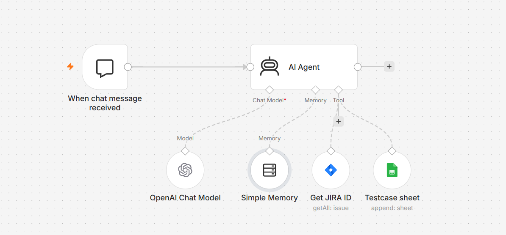
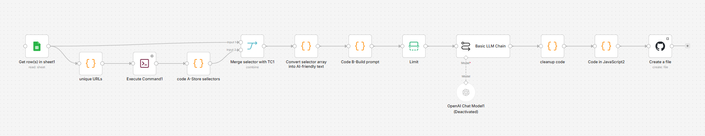
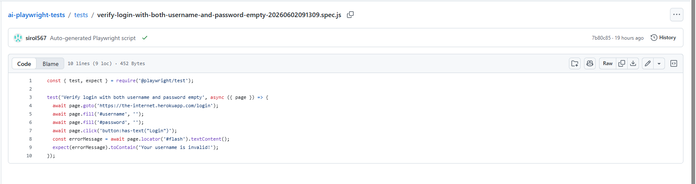
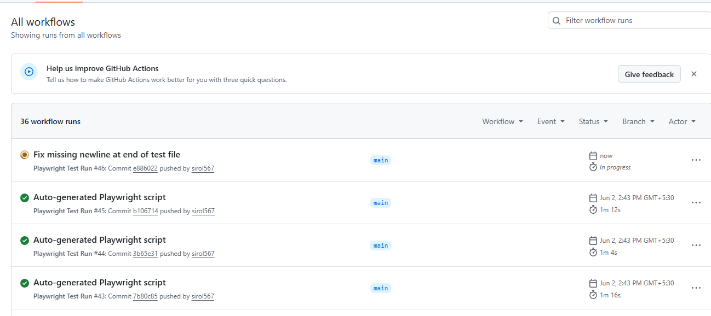
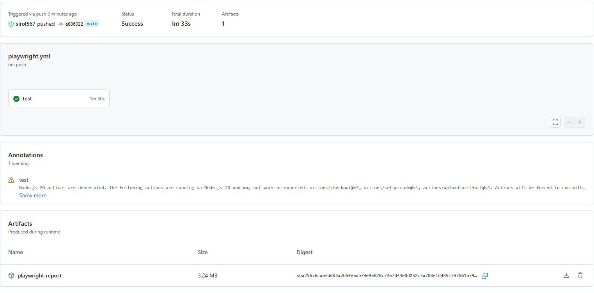
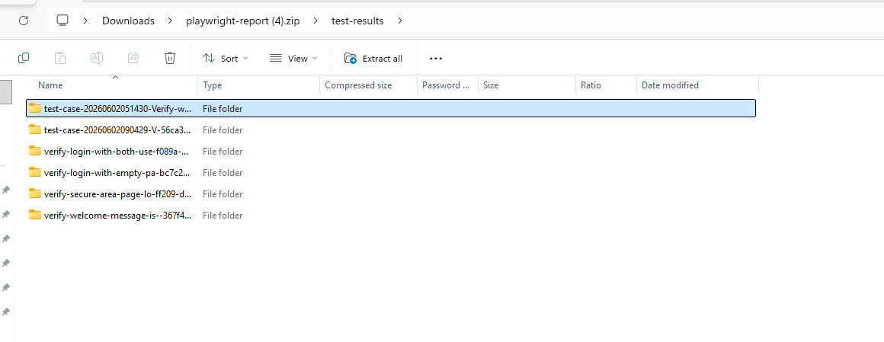

#  AI-Powered QA Automation Platform

> End-to-end AI-powered testing platform that transforms requirements into executable Playwright automation tests with zero manual scripting.

---

#  Overview

The AI-Powered QA Automation Platform automates the complete QA lifecycle using AI agents, Playwright, GitHub Actions, and n8n.

The platform automatically:

* Generates test cases from requirements
* Stores test cases in Google Sheets
* Extracts selectors from live applications using Playwright
* Generates Playwright automation scripts
* Merges scripts with extracted locators
* Commits code to GitHub
* Executes tests via GitHub Actions
* Generates screenshots and reports

---

#  Architecture

```text
┌─────────────────────┐
│ User Trigger        │
│ ("Generate")        │
└──────────┬──────────┘
           │
           ▼
┌─────────────────────┐
│ AI Requirement      │
│ Analysis            │
└──────────┬──────────┘
           │
           ▼
┌─────────────────────┐
│ AI Test Case        │
│ Generation          │
└──────────┬──────────┘
           │
           ▼
┌─────────────────────┐
│ Google Sheets       │
│ Storage             │
└──────────┬──────────┘
           │
           ▼
┌─────────────────────┐
│ Playwright          │
│ Selector Extraction │
└──────────┬──────────┘
           │
           ▼
┌─────────────────────┐
│ AI Script           │
│ Generation          │
└──────────┬──────────┘
           │
           ▼
┌─────────────────────┐
│ Locator Merge       │
└──────────┬──────────┘
           │
           ▼
┌─────────────────────┐
│ GitHub Commit       │
└──────────┬──────────┘
           │
           ▼
┌─────────────────────┐
│ GitHub Actions      │
└──────────┬──────────┘
           │
           ▼
┌─────────────────────┐
│ Playwright Tests    │
└──────────┬──────────┘
           │
           ▼
┌─────────────────────┐
│ Reports &           │
│ Screenshots         │
└─────────────────────┘
```

---

#  Workflow Screenshots

## Test Case Generation Agent



### Responsibilities

* Accepts generation requests
* Processes requirements
* Uses Groq/Ollama during development
* Uses OpenAI in production
* Generates structured test cases
* Stores output in Google Sheets

---

## Automation Generation Workflow



### Responsibilities

* Reads generated test cases
* Extracts selectors using Playwright
* Generates automation scripts
* Merges scripts with extracted locators
* Commits scripts to GitHub
* Triggers GitHub Actions
* Executes tests automatically
* Captures screenshots

---

# 📷 Execution Evidence

## Generated Playwright Script



This demonstrates AI-generated Playwright automation code built dynamically from generated test cases.

---

## GitHub Actions Run



This demonstrates fully automated CI/CD execution triggered on every generated commit.

---

## Playwright Report Generation



This demonstrates automated test reporting and execution tracking.

---

## Reports Overview



This demonstrates centralized execution monitoring and test result visibility.

---

## Playwright Execution Result


This demonstrates automated execution evidence and screenshot capture.

---

#  End-to-End Pipeline

| Stage                | Description                               |
| -------------------- | ----------------------------------------- |
| Trigger              | User starts generation                    |
| Requirement Analysis | AI processes requirements                 |
| Test Case Generation | Structured test cases generated           |
| Storage              | Saved to Google Sheets                    |
| Selector Extraction  | Playwright discovers locators             |
| Script Generation    | AI generates Playwright code              |
| Locator Merge        | Scripts combined with extracted selectors |
| GitHub Commit        | Code pushed automatically                 |
| CI/CD Execution      | GitHub Actions runs tests                 |
| Reporting            | Screenshots and reports generated         |

---

#  Key Features

## AI Test Case Generation

Generates structured test cases from requirements without manual effort.

### Benefits

* Faster QA cycles
* Consistent test coverage
* Reduced documentation effort

---

## Dynamic Selector Extraction

Uses Playwright to extract real application locators.

### Benefits

* Higher script reliability
* Reduced maintenance
* Real-world locator validation

---

## AI Script Generation

Creates executable Playwright JavaScript scripts automatically.

### Benefits

* Eliminates manual scripting
* Speeds up automation development
* Improves scalability

---

## GitHub Integration

Automatically commits generated scripts.

### Benefits

* Version control
* Traceability
* Team collaboration

---

## CI/CD Execution

Triggers GitHub Actions automatically.

### Benefits

* Continuous testing
* Automated validation
* Immediate feedback

---

## Screenshot Generation

Captures screenshots during execution.

### Benefits

* Execution evidence
* Easier debugging
* Better reporting

---

#  Technical Challenges Solved

## Challenge 1: Selector Reliability

### Problem

AI-generated selectors often become unstable.

### Solution

Implemented Playwright-based selector extraction directly from the target application.

---

## Challenge 2: Script Accuracy

### Problem

Generated scripts may not align with actual UI elements.

### Solution

Created a locator merge engine that combines generated logic with extracted selectors.

---

## Challenge 3: Continuous Validation

### Problem

Generated tests require automated verification.

### Solution

Integrated GitHub Actions for continuous execution and validation.

---

#  Technology Stack

| Category            | Technologies           |
| ------------------- | ---------------------- |
| Testing             | Playwright, JavaScript |
| AI Models           | OpenAI, Groq, Ollama   |
| Workflow Automation | n8n                    |
| CI/CD               | GitHub Actions         |
| Storage             | Google Sheets          |
| Integrations        | Jira API, GitHub API   |
| Version Control     | GitHub                 |

---

#  Business Impact

This platform automates:

* Requirement analysis
* Test case creation
* Locator extraction
* Script development
* Test execution
* Reporting

Resulting in:

* Reduced manual effort
* Faster regression cycles
* Improved automation coverage
* Consistent test quality
* Scalable automation generation

---

#  Future Enhancements

* Self-healing locators
* API automation generation
* Visual regression testing
* Cross-browser execution
* AI-based defect categorization
* Automatic bug creation

---

#  Author

**Sirol Varshini**

QA Engineer | Automation Engineer

### Specializations

* AI-PoweredPlaywright Automation Testing
* Test Automation Frameworks
* Workflow Automation
* CI/CD Testing
* Quality Engineering
